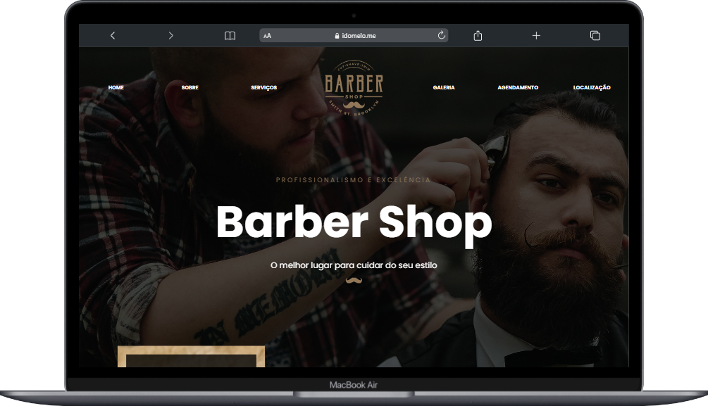

# Aqui eu adiciono projetos construídos para fixar o que aprendi.

>Links para visualização:

## Curso-full-stack-javascript:  

- [Barber Shop (responsivo)](https://idomelo.me/learning-HTML-CSS/curso-forma%C3%A7%C3%A3o-full-stack-javascript/barber-shop)

  

- [Menu de site](https://idomelo.me/learning-HTML-CSS/curso-formação-full-stack-javascript/menu-de-site)

- [Landing page para Workshop (responsivo)](https://idomelo.me/learning-HTML-CSS/curso-formação-full-stack-javascript/landing-page)
